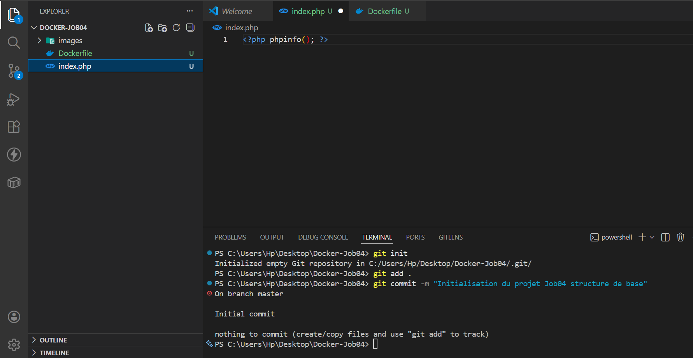

# Job 04 - Docker Apache & PHP : Serveur Web Conteneurisé

Ce projet a pour but de créer une image Docker personnalisée capable d'exécuter un serveur Apache et d'afficher les informations de configuration PHP via la fonction `phpinfo()`.

---

## 1. Préparation des fichiers

Nous avons besoin de deux fichiers essentiels :

1.  `index.php` : Contient la commande `<?php phpinfo(); ?>` pour afficher les infos du serveur.
2.  `Dockerfile` : Utilise l'image de base `php:8.2-apache` et copie notre script PHP au bon endroit dans le conteneur.



---

## 2. Construction de l'image (Build)

Création de l'image locale nommée `my-apache-php` à partir du Dockerfile.

**Commande :**

```bash
docker build -t my-apache-php .
```
